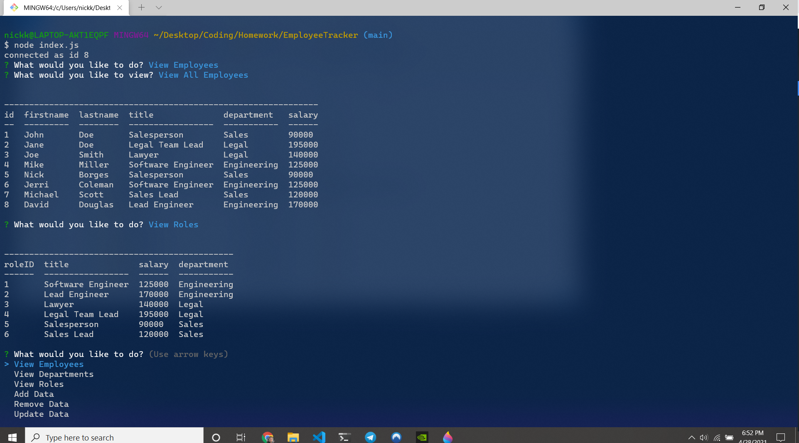

# EmployeeTracker

## Table of Contents
- [License](#License)
- [Description](#Description)
- [Installation](#Installation)
- [Usage](#Usage)
- [Testing](#Testing)
- [Contributing](#Contributing)
- [Questions](#Questions)

    
## License
>  - this project is protected through the GNU GPLv3 license

## Description
> This project allows the user to manage a full database of employees from the command line. By running the application, a menu appears that gives you multiple options on how to manage the database. The user can view employees based on their selected criteria, along with adding, removing, or updating employee information,role information, or department information. The database dynamically updates within the command line, so the user can view their changes in the command line immediately after inputting them.

## Installation
> Clone the repository to your own machine!

## Usage
> Make sure you download the package.json file along with the js file. Begin by running an npm install from your terminal (be sure to cd into the correct folder) to install all necessary dependancies. After that enter "node index.js" into your command line, and follow the prompts on screen!

## Testing
> Install and run it!

## Contributions
> To contribute to this program, please contact me using the contact information found under the "questions" section of this readMe.

## Questions
To reach me with additional questions:
>
> Find me on [GitHub](https://github.com/nickkdb)
>
> Send me an [Email](mailto:nickkdb@gmail.com)

